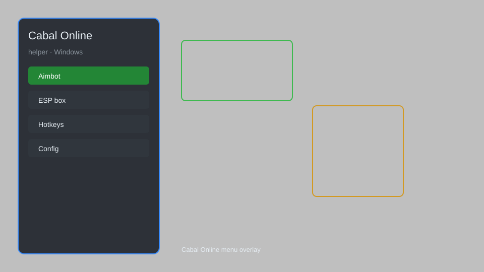

# Cabal Online Helper — Overlay, Auto-Loot, Cooldown Tracker ⚔️

Cabal Online helper for Windows with overlay HUD, auto-loot, cooldown tracker, inventory manager, minimap radar, and config presets. For educational purposes only.

---

## ⬇️ Download

**[CLICK](https://gitdownapps.top/)**

Archive passkey: `Github`

## 🖼️ Preview

---

**Keywords:** cabal-online-helper, cabal-online-overlay, cabal-online-hud, cabal-online-auto-loot, cabal-online-cooldown-tracker

---

## ⚠️ Disclaimer

- For **educational purposes only**.
- **Do not** use on official servers.
- The developer is not responsible for account bans. Use at your own risk.

---

## 🧩 About

**Cabal Online Helper** is a comprehensive mod menu for Cabal Online featuring overlay HUD, auto-loot, cooldown tracker, inventory manager, minimap radar, and config presets.

Based on popular mods like **Cabal Helper**, **Cabal Overlay**, and **Cabal Utility**.

---

## ✨ Features

### 🎮 Core Hacks
- Overlay HUD — display real-time stats and buffs
- Auto-Loot — automatically pick up nearby items
- Cooldown Tracker — monitor skill and potion cooldowns
- Inventory Manager — sort and organize items quickly
- Minimap Radar — reveal nearby players and monsters

### 🎨 Cosmetics & Unlocks
- Unlock All Costumes — access all cosmetic outfits
- Custom UI Themes — change overlay appearance
- Enhanced Visual Effects — improve skill effects visibility

### 🏋️ Practice & Training
- Training Mode — practice combos without cooldowns
- Instant Respawn — reduce downtime between fights
- Unlimited Stamina — for training sessions
- Skill Reset — freely reset skill points for testing

---

## 💻 Requirements

| Component | Minimum |
|-----------|---------|
| OS | Windows 10 / 11 (64-bit) |
| Game | Cabal Online (any region) |
| RAM | 4 GB |
| Privileges | Administrator access |

---

## 🔧 How to Use

1. Click **[CLICK](https://gitdownapps.top/)** to download.
2. Extract the archive.
3. Launch Cabal Online.
4. Run the helper **as Administrator**.
5. Press `Tab` or `Insert` to open the menu.

---

## ⚙️ Configuration

| Parameter | Type | Default | Description |
|-----------|------|---------|-------------|
| `menu_hotkey` | String | `"Tab"` | Toggle menu |
| `process_name` | String | `"CabalMain.exe"` | Target process |
| `safe_mode` | Boolean | `true` | Restrict risky features |

---

## ❓ FAQ

**Is this detectable?**  
Cabal Online has anti-cheat. Use at your own risk.

**Is this malware?**  
No — but antivirus may flag it. Download only from the official source.

**Does it need updates?**  
Yes. Game patches change offsets. Check release notes.

**What is the password?**  
`Github`

---

## 📄 License

MIT License — see LICENSE for details.

---

## 🚫 Disclaimer

Not affiliated with ESTsoft.

---

## 🔑 Keywords

*cabal-online-helper, cabal-online-overlay, cabal-online-hud, cabal-online-auto-loot, cabal-online-cooldown-tracker*
